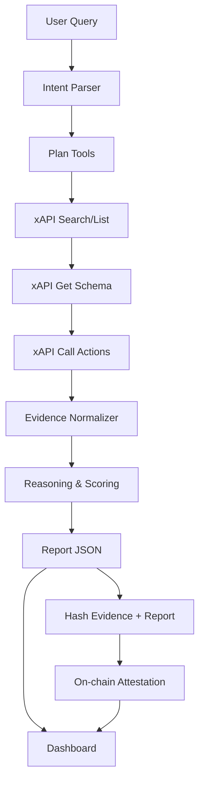

# ChainPulse Agent 需求文档

**版本**：v1.0  
**目标赛事**：ETH Beijing 2026 — AI Agent 主赛道 + xAPI Track  
**项目定位**：面向 Crypto 投研、DAO 治理、项目方风控的 AI Agent。它通过 xAPI 自动发现并调用社交、新闻、Web、Crypto 与 AI 能力，生成可解释的链上风险 / Alpha 报告，并将报告摘要与证据哈希写入区块链，形成可验证、可复查、可追责的 Agent 决策记录。

---

## 1. 项目一句话

**ChainPulse Agent 是一个“会查资料、会交叉验证、会给风险结论、会把证据上链”的 Web3 情报智能体。**

用户输入一个 Token、合约地址、项目名或热点事件后，Agent 会通过 xAPI 拉取 Twitter / X 信号、实时 Web 搜索、新闻、Token 价格与元数据，再用大模型完成去噪、归因、打分和报告生成，最后把报告哈希、证据哈希、风险分、结论和时间戳写入测试网合约。

---

## 2. 参赛目标

### 2.1 主赛道目标：AI Agent

展示一个完整的自主智能体闭环：

1. 自动拆解用户任务。
2. 自动发现可用 xAPI action。
3. 按“先读取 schema，再执行 call”的方式调用工具。
4. 多源信息交叉验证。
5. 输出结构化报告、风险评分和行动建议。
6. 将关键证据摘要写入链上，形成可验证记录。

### 2.2 xAPI Track 目标：最佳 xAPI 应用

重点展示 xAPI 的创新使用，而不是只做普通 API 调用：

1. 动态发现 action：`xapi-to search` / `xapi-to list`。
2. 动态读取 action schema：`xapi-to get <action>`。
3. 多能力编排：Twitter、Web、News、AI、Crypto Token。
4. JSON 结果进入 Agent 推理链。
5. 对每次 xAPI 调用生成可视化 trace，方便评委看到 xAPI 被如何使用。
6. API Key 只保存在服务端，前端不暴露密钥。

---

## 3. 目标用户与使用场景

### 3.1 目标用户

| 用户 | 需求 | ChainPulse 提供的价值 |
|---|---|---|
| Crypto 投资者 | 想快速判断一个 Token 是否有异常热度或潜在风险 | 汇总社交、新闻、价格和元数据，给出风险评分 |
| DAO 治理成员 | 投票前需要理解某个协议或资产的外部信号 | 生成可复查的证据报告，并上链留痕 |
| 项目方 BD / Marketing | 需要追踪社区关注点和 KOL 反馈 | 监控话题、生成摘要和传播建议 |
| 安全研究员 | 需要识别异常传播、钓鱼、假新闻或操纵信号 | 多源交叉验证，标记可疑信号 |
| 黑客松评委 | 需要快速判断项目是否真的用了 xAPI 与 Blockchain | Demo 展示 xAPI trace + 链上交易哈希 |

### 3.2 典型场景

**场景 A：Token 风险扫描**  
用户输入 `$ETH`、`$ZEC`、`$XYZ` 或合约地址。Agent 拉取 Twitter 热点、新闻、Web 结果、Token 价格与元数据，判断是否存在异常舆情、价格波动、诈骗风险或信息不一致。

**场景 B：KOL 观点聚合**  
用户输入某位 KOL 的 Twitter 用户名或话题关键词。Agent 获取近期推文与相关讨论，生成观点摘要、情绪判断、可信度和潜在偏见提示。

**场景 C：DAO 投票前尽调**  
用户输入一个治理提案或项目名称。Agent 生成“支持 / 反对 / 观察”建议，并把报告哈希写入链上，作为治理前的公开尽调记录。

---

## 4. 核心问题定义

Crypto 信息分散在 Twitter / X、新闻、项目官网、区块链浏览器和价格站点中。普通用户很难判断：

1. 某个热点是否真实。
2. 某个 Token 是否被 KOL 集中带节奏。
3. 某条消息是否有可靠来源。
4. AI 生成的结论是否可以复查。
5. DAO 或团队在做决策时是否留下了可审计记录。

**ChainPulse Agent 的核心假设**：  
AI Agent 可以通过 xAPI 快速接入多源外部能力，区块链可以保存报告与证据的不可篡改摘要，二者结合能显著提高 Web3 信息决策的可解释性和可信度。

---

## 5. MVP 功能范围

### 5.1 必做功能

| 编号 | 功能 | 优先级 | 说明 |
|---|---|---|---|
| F1 | 输入任务 | P0 | 支持输入 Token 符号、项目名、合约地址、KOL 用户名、关键词 |
| F2 | xAPI action 发现 | P0 | 后端调用 `xapi-to search` 和 `xapi-to get`，展示 Agent 选择工具过程 |
| F3 | 多源数据采集 | P0 | 至少调用 Twitter、Web Search、News、Crypto Token、AI Summarize / Reasoning 中的 4 类能力 |
| F4 | Agent 推理与报告 | P0 | 生成摘要、风险评分、Alpha 评分、证据列表、结论、行动建议 |
| F5 | 证据包生成 | P0 | 将原始证据 ID、来源、摘要、时间戳、xAPI action 名称组成 evidence packet |
| F6 | 链上证明 | P0 | 对 evidence packet 和 report JSON 求 hash，写入测试网合约 |
| F7 | Dashboard | P0 | 展示报告、评分、xAPI trace、链上交易哈希 |
| F8 | Demo 脚本 | P0 | 准备 2 个稳定可演示案例，避免现场网络或数据不稳定导致失败 |

### 5.2 可选加分功能

| 编号 | 功能 | 优先级 | 说明 |
|---|---|---|---|
| A1 | Twitter OAuth 绑定 | P1 | 若 xAPI 现场能力允许，绑定账号用于更完整的社交数据读取 |
| A2 | 报告分享卡片 | P1 | 生成一张风险报告图，便于路演展示 |
| A3 | x402 付费访问 | P2 | 把高级报告接口做成 x402 / USDC 付费访问，体现 Web3 商业闭环 |
| A4 | EAS Attestation | P2 | 使用 Ethereum Attestation Service 替代自定义合约，提升生态兼容性 |
| A5 | Agent 自动定时巡检 | P2 | 设定 watchlist 后定时拉取信号并更新报告 |

---

## 6. 用户流程

### 6.1 标准流程

1. 用户进入首页。
2. 输入查询对象：如 `ETH`, `ZEC`, `某项目名称`, `@某KOL`。
3. 选择模式：
   - Alpha Scan：寻找机会信号。
   - Risk Scan：寻找风险信号。
   - DAO Due Diligence：治理尽调。
4. 点击“Run Agent”。
5. 后端创建任务。
6. Agent 调用 xAPI：
   - 搜索相关 action。
   - 获取 action schema。
   - 调用 Twitter / Web / News / Crypto / AI action。
7. Agent 生成证据包。
8. Agent 输出报告。
9. 用户点击“Attest on-chain”。
10. 前端调用钱包签名并提交交易。
11. Dashboard 展示交易哈希、报告哈希、证据哈希。

### 6.2 评委演示流程

1. 展示首页输入框。
2. 输入 `$ETH` 或一个现场热点关键词。
3. 展示 Agent trace：评委能看到使用了哪些 xAPI action。
4. 展示报告：风险分、Alpha 分、证据列表、结论。
5. 点击上链，钱包确认。
6. 打开区块浏览器或内置交易详情页。
7. 解释：AI 结论不是黑箱，证据和摘要已形成可验证链上记录。

---

## 7. Agent 设计

### 7.1 Agent 角色

**ChainPulse Research Agent**

职责：

1. 理解用户查询对象。
2. 判断需要哪些外部数据。
3. 通过 xAPI 发现并调用工具。
4. 对多源结果进行去重、可信度评估和交叉验证。
5. 生成报告。
6. 生成链上证明所需的标准化数据。

### 7.2 Agent 工作流



### 7.3 Prompt 策略

系统提示词要约束 Agent：

1. 不允许无证据下结论。
2. 每个结论必须关联 evidence item。
3. 区分事实、推断和建议。
4. 对社交媒体内容标记为“弱证据”，除非有新闻、官网或链上数据佐证。
5. 输出固定 JSON，便于前端渲染和上链哈希。

### 7.4 输出 JSON 示例

```json
{
  "topic": "ETH",
  "mode": "Risk Scan",
  "summary": "ETH 近期讨论热度稳定，未发现明显社交操纵信号。",
  "riskScore": 32,
  "alphaScore": 68,
  "confidence": 0.74,
  "verdict": "OBSERVE",
  "evidence": [
    {
      "id": "ev_001",
      "source": "xapi:twitter.search_timeline",
      "title": "Recent ETH discussion cluster",
      "summary": "多位用户讨论 ETH 生态更新，情绪偏中性。",
      "weight": 0.25
    }
  ],
  "actions": [
    "继续观察 24h 社交热度变化",
    "若风险分高于 70，建议暂停自动交易或治理投票"
  ]
}
```

---

## 8. xAPI 使用方案

### 8.1 xAPI 调用原则

1. 不硬编码全部 action，优先用搜索发现。
2. 调用前必须读取 schema。
3. 所有输出使用 JSON，便于 Agent 消费。
4. API Key 只保存在后端环境变量，不进入浏览器。
5. 每次调用都记录 trace：action、input 摘要、输出摘要、耗时、状态。

### 8.2 计划使用的 xAPI capabilities

| 类别 | 可能使用的 action | 用途 |
|---|---|---|
| Twitter / X | `twitter.search_timeline` | 搜索热点、舆情、KOL 讨论 |
| Twitter / X | `twitter.tweet_detail` | 拉取推文详情与回复 |
| Twitter / X | `twitter.user_tweets` | 获取 KOL 最近观点 |
| Web | `web.search` / `web.search.realtime` | 查找项目资料、公告、实时信息 |
| News | `news.search.latest` | 获取最新新闻 |
| Crypto | `crypto.token.price` | 获取 Token 价格与涨跌 |
| Crypto | `crypto.token.metadata` | 获取 Token 元数据 |
| AI | `ai.text.summarize` | 压缩长文本证据 |
| AI | `ai.text.chat.reasoning` | 综合分析和评分 |
| AI | `ai.embedding.generate` | 证据去重与相似度聚类 |

### 8.3 xAPI trace 数据结构

```ts
interface XApiTrace {
  id: string;
  taskId: string;
  action: string;
  schemaFetched: boolean;
  inputHash: string;
  outputHash: string;
  outputPreview: string;
  startedAt: string;
  endedAt: string;
  status: "success" | "failed";
  error?: string;
}
```

---

## 9. Blockchain 设计

### 9.1 为什么需要上链

ChainPulse 不把大段文本和隐私数据直接上链，而是把报告和证据包的 hash 写入链上。这样可以：

1. 证明报告在某个时间点已经生成。
2. 证明报告没有被赛后篡改。
3. 让 DAO 或用户可以复查同一份报告。
4. 为 Agent 决策建立审计轨迹。

### 9.2 合约设计

合约名称：`SignalAttestation.sol`

核心事件：

```solidity
// SPDX-License-Identifier: MIT
pragma solidity ^0.8.24;

contract SignalAttestation {
    struct Report {
        bytes32 reportHash;
        bytes32 evidenceHash;
        string topic;
        uint8 riskScore;
        uint8 alphaScore;
        string verdict;
        string metadataURI;
        address creator;
        uint256 createdAt;
    }

    uint256 public reportCount;
    mapping(uint256 => Report) public reports;

    event ReportAttested(
        uint256 indexed reportId,
        address indexed creator,
        string topic,
        uint8 riskScore,
        uint8 alphaScore,
        string verdict,
        bytes32 reportHash,
        bytes32 evidenceHash,
        string metadataURI,
        uint256 createdAt
    );

    function attest(
        bytes32 reportHash,
        bytes32 evidenceHash,
        string calldata topic,
        uint8 riskScore,
        uint8 alphaScore,
        string calldata verdict,
        string calldata metadataURI
    ) external returns (uint256 reportId) {
        require(riskScore <= 100, "riskScore > 100");
        require(alphaScore <= 100, "alphaScore > 100");

        reportId = ++reportCount;
        reports[reportId] = Report({
            reportHash: reportHash,
            evidenceHash: evidenceHash,
            topic: topic,
            riskScore: riskScore,
            alphaScore: alphaScore,
            verdict: verdict,
            metadataURI: metadataURI,
            creator: msg.sender,
            createdAt: block.timestamp
        });

        emit ReportAttested(
            reportId,
            msg.sender,
            topic,
            riskScore,
            alphaScore,
            verdict,
            reportHash,
            evidenceHash,
            metadataURI,
            block.timestamp
        );
    }
}
```

### 9.3 链选择

MVP 建议使用：

1. **Sepolia**：以太坊生态评委容易理解。
2. **Base Sepolia**：如果要结合 x402 / USDC 支付，Base 生态叙事更顺。

最终选择一个测试网即可，避免多链部署增加调试风险。

---

## 10. 系统架构

### 10.1 技术栈

| 模块 | 建议技术 |
|---|---|
| 前端 | Next.js + React + TailwindCSS |
| 钱包连接 | wagmi + viem + RainbowKit |
| 后端 | Node.js / Next.js API Routes / Express |
| Agent 编排 | LangGraph.js 或自定义状态机 |
| xAPI 调用 | `xapi-to` CLI，通过后端 `child_process` 包装；或直接调用 xAPI HTTP endpoint |
| LLM | 腾讯混元 / OpenAI-compatible LLM / 本地可替代模型 |
| 数据库 | SQLite / Supabase Postgres |
| 合约开发 | Foundry 或 Hardhat |
| 文件存储 | 本地 JSON / IPFS / Pinata，可先用本地 mock URI |
| 部署 | Vercel + Railway / Render / 本地 Demo |

### 10.2 后端模块

```txt
backend/
  agents/
    planner.ts
    researcher.ts
    scorer.ts
    report-writer.ts
  xapi/
    client.ts
    schema-cache.ts
    trace-recorder.ts
  blockchain/
    attestation.ts
  db/
    schema.ts
  api/
    tasks.ts
    reports.ts
    attest.ts
```

### 10.3 前端页面

| 页面 | 说明 |
|---|---|
| `/` | 输入查询对象，选择模式，启动 Agent |
| `/task/[id]` | 展示 Agent 执行状态、xAPI trace、报告草稿 |
| `/report/[id]` | 展示最终报告、风险评分、证据列表、链上证明 |
| `/admin/actions` | 展示当前 xAPI action 搜索结果和 schema，便于 Demo |

---

## 11. 数据模型

### 11.1 Task

```ts
interface Task {
  id: string;
  query: string;
  mode: "alpha" | "risk" | "dao";
  status: "pending" | "running" | "completed" | "failed";
  createdAt: string;
  updatedAt: string;
}
```

### 11.2 EvidenceItem

```ts
interface EvidenceItem {
  id: string;
  taskId: string;
  sourceAction: string;
  sourceType: "twitter" | "web" | "news" | "crypto" | "ai";
  title: string;
  url?: string;
  rawHash: string;
  summary: string;
  weight: number;
  createdAt: string;
}
```

### 11.3 Report

```ts
interface Report {
  id: string;
  taskId: string;
  topic: string;
  summary: string;
  riskScore: number;
  alphaScore: number;
  confidence: number;
  verdict: "BULLISH" | "BEARISH" | "RISK" | "OBSERVE" | "INSUFFICIENT_DATA";
  evidenceIds: string[];
  actions: string[];
  reportHash: string;
  evidenceHash: string;
  metadataURI?: string;
  txHash?: string;
  createdAt: string;
}
```

---

## 12. API 设计

### 12.1 创建任务

`POST /api/tasks`

请求：

```json
{
  "query": "ETH",
  "mode": "risk"
}
```

返回：

```json
{
  "taskId": "task_123",
  "status": "pending"
}
```

### 12.2 获取任务状态

`GET /api/tasks/:id`

返回：

```json
{
  "taskId": "task_123",
  "status": "running",
  "currentStep": "Calling xAPI: news.search.latest",
  "traces": []
}
```

### 12.3 获取报告

`GET /api/reports/:id`

返回 Report JSON。

### 12.4 上链证明

`POST /api/attest`

请求：

```json
{
  "reportId": "report_123",
  "walletAddress": "0x..."
}
```

返回：

```json
{
  "txHash": "0x...",
  "contract": "0x...",
  "reportHash": "0x...",
  "evidenceHash": "0x..."
}
```

---

## 13. 评分方法

### 13.1 风险评分 Risk Score

范围：0-100，越高风险越大。

| 维度 | 权重 | 说明 |
|---|---:|---|
| 社交异常 | 25% | 短时间集中讨论、重复内容、疑似机器人传播 |
| 新闻负面 | 20% | 安全事件、监管、项目方负面新闻 |
| 价格异常 | 20% | 价格快速波动、成交异常，可先用 token price 近似 |
| 来源可信度 | 20% | 是否来自官网、主流媒体、可靠 KOL、多源佐证 |
| 信息一致性 | 15% | 多源结果是否互相冲突 |

### 13.2 Alpha 评分 Alpha Score

范围：0-100，越高代表机会信号越强。

| 维度 | 权重 | 说明 |
|---|---:|---|
| 正向社交热度 | 25% | 社区活跃、KOL 正向讨论 |
| 新事件催化 | 25% | 技术升级、生态合作、重要公告 |
| 基本面匹配 | 20% | Token 元数据、项目叙事、生态位置 |
| 价格确认 | 15% | 价格趋势是否支持叙事 |
| 低风险折扣 | 15% | 风险越低，Alpha 分越可信 |

---

## 14. 非功能需求

| 类别 | 要求 |
|---|---|
| 性能 | 单次 Demo 查询尽量在 30-60 秒内完成 |
| 可用性 | xAPI 调用失败时使用缓存或示例数据兜底，但 UI 必须标记为 fallback |
| 安全 | XAPI_KEY 仅在服务端环境变量；不得展示完整 API Key |
| 可解释性 | 每个结论必须能追溯到 evidence item |
| 可验证性 | reportHash 和 evidenceHash 必须可本地复算 |
| 成本控制 | LLM 调用先摘要再推理，避免把所有原文直接塞入模型 |
| 可演示性 | 准备本地 mock 数据，防止现场 API 限速或网络问题 |

---

## 15. 验收标准

### 15.1 产品验收

1. 用户可以输入一个 Token 或关键词并启动任务。
2. 系统至少调用 4 类 xAPI action。
3. 页面展示完整 xAPI trace。
4. 系统生成结构化报告。
5. 报告包含 summary、riskScore、alphaScore、confidence、verdict、evidence、actions。
6. 用户可以把 reportHash 和 evidenceHash 写入测试网合约。
7. 页面展示 txHash 和合约地址。
8. GitHub README 包含本地启动说明、环境变量说明、Demo 截图和合约地址。

### 15.2 路演验收

1. 3 分钟内讲清楚问题和方案。
2. 1 分钟内讲清楚 xAPI 用在哪里。
3. 1 分钟内讲清楚区块链不可替代的作用。
4. 现场能跑出 Demo 或播放 Demo 视频。
5. 评委能看到 GitHub 公开仓库。

---

## 16. 开发排期

### Day 1：6 月 5 日

| 时间 | 任务 |
|---|---|
| 下午 | 确认队伍分工、确定技术栈、创建 GitHub 仓库 |
| 晚上 | 完成需求文档、Demo 脚本、UI 原型 |
| 晚上 | 完成 xAPI 注册、health check、action search/get/call 最小样例 |
| 深夜 | 合约初版 + 前端首页 + 后端任务 API |

### Day 2：6 月 6 日

| 时间 | 任务 |
|---|---|
| 上午 | 完成 Agent 调用链：query -> xAPI -> evidence -> report |
| 下午 | 完成 Dashboard、trace 展示、报告页面 |
| 傍晚 | 完成合约部署与 attest 流程 |
| 21:00 前 | 提交项目进度报告到 GitHub |
| 晚上 | 录制第一版 Demo 视频，修 Bug，准备兜底数据 |

### Day 3：6 月 7 日

| 时间 | 任务 |
|---|---|
| 上午 | 完成 README、项目介绍材料、最终 Demo 视频 |
| 12:00 前 | 最终提交 |
| 下午 | 准备路演稿与现场演示 |

---

## 17. 团队分工建议

| 角色 | 人数 | 任务 |
|---|---:|---|
| Product / Pitch | 1 | 需求、路演、Demo 脚本、项目介绍材料 |
| Frontend | 1 | Next.js 页面、Dashboard、钱包连接 |
| Backend / Agent | 1-2 | xAPI client、Agent workflow、报告生成 |
| Smart Contract | 1 | 合约、部署、attestation、区块浏览器验证 |
| Design / Video | 0-1 | UI 美化、Demo 视频、PPT |

如果 Solo Hacker，优先级：后端 Agent + xAPI trace + 简单合约 + 极简 UI。

---

## 18. README 结构建议

```md
# ChainPulse Agent

## What it does
AI Agent for crypto risk and alpha research, powered by xAPI and on-chain attestations.

## Why it matters
Crypto decisions are noisy and hard to audit. ChainPulse combines multi-source xAPI signals with blockchain proof.

## How it uses xAPI
- xapi-to search / list
- xapi-to get schema
- xapi-to call twitter / web / news / crypto / ai actions
- xAPI trace dashboard

## How it uses Blockchain
- SignalAttestation contract
- reportHash + evidenceHash on-chain
- verifiable txHash

## Architecture
Diagram + module explanation

## Quick Start
pnpm install
cp .env.example .env.local
pnpm dev

## Environment Variables
XAPI_KEY=
HUNYUAN_API_KEY=
PRIVATE_KEY=
NEXT_PUBLIC_CONTRACT_ADDRESS=

## Demo
Demo video link
Contract address
Example report

## Team
Names
```

---

## 19. 路演话术

### 19.1 30 秒开场

Crypto 世界的信息非常嘈杂。一个 Token 的风险可能同时出现在 Twitter、新闻、价格变化和项目公告里，但普通用户很难把这些信号串起来，也很难证明 AI 的判断是不是事后改过。ChainPulse Agent 用 xAPI 让 AI Agent 自动调用多源能力，再把报告和证据哈希写入链上，让 Web3 决策既智能又可验证。

### 19.2 xAPI 亮点

我们不是简单调用一个 API，而是让 Agent 先通过 xAPI 搜索可用 action，再读取 schema，最后按任务动态调用 Twitter、Web、News、Crypto、AI 等能力。每一步都被记录到 trace 面板里，评委可以看到 xAPI 如何驱动 Agent 的真实工作流。

### 19.3 Blockchain 亮点

AI 报告本身不适合直接上链，因为体积大且可能包含敏感信息。我们把报告和证据包做 hash，写入测试网合约。这样任何人都可以在之后验证：这份报告在某个时间点已经存在，并且没有被篡改。

### 19.4 结尾

ChainPulse 可以服务投资者、DAO、项目方和安全研究员。它把 xAPI 的多源能力、AI Agent 的推理能力和区块链的可验证能力组合成一个完整闭环。

---

## 20. 风险与兜底方案

| 风险 | 影响 | 兜底 |
|---|---|---|
| xAPI 调用失败 | Demo 中断 | 准备 mock response，并在 UI 标注 fallback |
| Twitter OAuth 不稳定 | 社交数据不足 | 使用公开 search / user data；必要时切换 Web + News + Crypto |
| LLM 输出不稳定 | 报告格式错乱 | 强制 JSON schema 校验，失败后 retry |
| 合约部署失败 | 无法展示链上部分 | 预先部署测试网合约，现场只调用已部署合约 |
| 网络不稳定 | 路演失败 | 准备录屏 Demo 视频 |
| 时间不足 | 功能过多无法收尾 | 优先保留 xAPI trace、报告生成、链上证明三件事 |

---

## 21. 最小可交付清单

1. GitHub 公开仓库。
2. Next.js Demo 页面。
3. xAPI 调用封装与 trace 面板。
4. Agent 报告生成。
5. Solidity 合约。
6. 测试网部署地址。
7. Demo 视频。
8. 项目介绍材料 / PPT。
9. README。
10. 两个稳定演示案例。

---

## 22. 成功标准

这份项目的赢点不是“又一个信息聚合器”，而是：

1. **AI Agent 真正会用工具**：能动态发现和调用 xAPI 能力。
2. **xAPI 使用足够突出**：评委能直接看到 action schema、call trace、多能力组合。
3. **Blockchain 不生硬**：不是为了上链而上链，而是解决 AI 报告可验证和不可篡改的问题。
4. **Demo 可跑通**：输入、调用、报告、上链、展示一条龙。
5. **三天能完成**：MVP 范围清晰，复杂功能都放到加分项。

---

## 23. 建议最终项目名称备选

1. ChainPulse Agent
2. Proof-of-Alpha Agent
3. SignalGuard Agent
4. AlphaLens xAPI Agent
5. VerityPulse

建议使用 **ChainPulse Agent**，因为它同时表达链上、信号和智能体的概念，适合路演解释。
